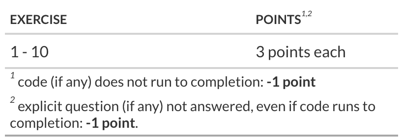

## Introduction

In today's lab, you'll practice building `workflowsets` with `recipes`, `parsnip` models, `rsample` cross validations, model tuning and model comparison.

### Learning goals

By the end of the lab you will...

-   Be able to build workflows to evaluate different models and feature sets.

## Getting started

-   Log in to **your** github account and then go to the [GitHub organization](https://github.com/bsmm-8740-fall-2025) for the course and find the **2025-lab-4-\[your github username\]** repository to complete the lab.

    Create an R project using your **2025-lab-4-\[your github username\]** repository (remember to create a PAT, etc., as in lab-1) and add your answers by editing the `2025-lab-4.qmd` file in your repository.

-   When you are done, be sure to: **save** your document, **stage**, **commit** and [**push**]{.underline} your work.

::: callout-important
To access Github from the lab, you will need to make sure you are logged in as follows:

-   username: **.\\daladmin**
-   password: **Business507!**

Remember to (create a PAT and set your git credentials)

-   create your PAT using `usethis::create_github_token()` ,
-   store your PAT with `gitcreds::gitcreds_set()` ,
-   set your username and email with
    -   `usethis::use_git_config( user.name = ___, user.email = ___)`
:::

## Packages

```{r}
#| message: false
# check if 'librarian' is installed and if not, install it
if (! "librarian" %in% rownames(installed.packages()) ){
  install.packages("librarian")
}
  
# load packages if not already loaded
librarian::shelf(
  tidyverse, magrittr, tidymodels, modeldata, ranger, rsample, broom, recipes, parsnip
)

# set the efault theme for plotting
theme_set(theme_bw(base_size = 18) + theme(legend.position = "top"))
```

::: callout-warning
## Package installs

If you install packages outside of the ones here, [**remove**]{.underline} your `install.packages(.)` code [**before submitting your solutions**]{.underline}.

Leaving instructions that will install packages may cause your code to fail, but more importantly, it can corrupt the TA/instructor's system.
:::

## The Data

Today we will be using the Ames Housing Data.

This is a data set from [De Cock](http://jse.amstat.org/v19n3/decock.pdf) (2011) has 82 fields were recorded for 2,930 properties in Ames Iowa in the US. The version in the `modeldata` package is copied from the `AmesHousing` package but does not include a few quality columns that appear to be outcomes rather than predictors.

```{r}
#| eval: false
#| label: load ames data
dat <- modeldata::ames
```

The data dictionary can be found on the internet:

```{r}
#| eval: false
#| label: show ames data dictionary
cat(readr::read_file("http://jse.amstat.org/v19n3/decock/DataDocumentation.txt"))
```

## Exercise 1: EDA

Write and execute the code to perform summary EDA on the Ames Housing data using the package `skimr`.

::: {#Q1 .callout-note appearance="simple" icon="false"}
## YOUR ANSWER Q1:

```{r}
#| label: run EDA on ames data
skimr::skim(dat)

```

Is there any missing data? Yes / No - No. There is no missing data.
:::

## Exercise 2: Train / Test Splits

Write and execute code to create training and test datasets. Have the training dataset represent 75% of the total data.

::: {#Q2 .callout-note appearance="simple" icon="false"}
## YOUR ANSWER Q2:

```{r}
#| eval: false
#| label: split ames data. into test and training datasets

set.seed(8740)
data_split <- rsample::initial_split(dat, prop=0.75)

ames_train <- rsample::training(data_split)
ames_test  <- rsample::testing(data_split)

```
:::

## Exercise 3: Data Preprocessing

create a recipe based on the formula **Sale_Price \~ Longitude + Latitude + Lot_Area + Neighborhood + Year_Sold** with the following steps:

-   transform the variable `Sale_Price` to `log(Sale_Price)`
-   center and scale all predictors
-   create dummy variables for all nominal variables
-   transform the variable `Neighborhood` to pool infrequent values (see `recipes::step_other`)

Think carefully about the order of the steps in your recipe.

Finally prep the recipe.

::: {#Q3 .callout-note appearance="simple" icon="false"}
## YOUR ANSWER Q3:

```{r}
#| eval: false
#| label: create recipe, add preprocessing steps then prep the recipe. 

norm_recipe <- 
  recipes::recipe(
    Sale_Price ~ Longitude + Latitude + Lot_Area + Neighborhood + Year_Sold,
    data = ames_train #using the training set
  ) %>% 

  # Transform the outcome
  recipes::step_log(recipes::all_outcomes()) %>%
  
  # Normalize only original numeric predictors
  recipes::step_normalize(recipes::all_numeric_predictors())%>%
  
  # Pool infrequent Neighborhood levels first
  recipes::step_other(Neighborhood, threshold=0.02, other="other_neigh")%>%
  
  # Create dummy variables
  recipes::step_dummy(recipes::all_nominal_predictors())%>%
  
  # Prep the recipe
  recipes::prep(training = ames_train, retain = TRUE)
  
  # Show the summary
  broom::tidy(norm_recipe)
  
  

```
:::

## Exercise 4 Modeling

Create three regression models

-   a base regression model using `lm`

-   a regression model using `glmnet`; set the model parameters `penalty` and `mixture` for tuning

-   a tree model using the `ranger` engine; set the model parameters `min_n` and `trees` for tuning

::: {#Q4 .callout-note appearance="simple" icon="false"}
## YOUR ANSWER Q4:

```{r}
#| eval: false
#| label: specify lm, elastic net, and random forest, the latter two with with parameter tuning

lm_mod_base <- 
  parsnip::linear_reg() %>%
  parsnip::set_engine("lm")

lm_mod_glmnet <- 
  parsnip::linear_reg(
    penalty = tune(),
    mixture = tune()
  ) %>%
  parsnip::set_engine("glmnet")

lm_mod_rforest <- 
  parsnip::rand_forest(
    trees = tune(),
    min_n = tune()
  ) %>%
  parsnip::set_engine("ranger")%>%
  parsnip::set_mode("regression")

lm_mod_base
lm_mod_glmnet
lm_mod_rforest
```
:::

## Exercise 5

Use parsnip::translate() on each model to see the code object that is specific to a particular engine

::: {#Q5 .callout-note appearance="simple" icon="false"}
## YOUR ANSWER Q5:

```{r}
#| label: show internal code for each model specification, using translate

parsnip::translate(lm_mod_base)
parsnip::translate(lm_mod_glmnet)
parsnip::translate(lm_mod_rforest)

```
:::

## Exercise 6 Bootstrap

Create bootstrap samples for the training dataset. You can leave the parameters set to their defaults

::: {#Q6 .callout-note appearance="simple" icon="false"}
## YOUR ANSWER Q6:

```{r}
#| eval: false
#| label: create bootstrap resamples from the data

set.seed(8740)
train_resamples <- rsample::bootstraps(ames_train)
```
:::

::: render-commit-push
This is a good place to render, commit, and push changes to your remote lab repo on GitHub. Click the checkbox next to each file in the Git pane to stage the updates you've made, write an informative commit message, and push. After you push the changes, the Git pane in RStudio should be empty.
:::

## Exercise 7

Create workflows with `workflowsets::workflow_set` using your recipe and models.

::: {#Q7 .callout-note appearance="simple" icon="false"}
## YOUR ANSWER Q7:

```{r}
#| eval: false
#| label: create a workflowset from your recipe and model specifications

norm_recipe_spec <-
  recipes::recipe(
    Sale_Price ~ Longitude + Latitude + Lot_Area + Neighborhood + Year_Sold,
    data = ames_train
  ) %>%
  recipes::step_log(recipes::all_outcomes()) %>%                          
  recipes::step_normalize(recipes::all_numeric_predictors()) %>%          
  recipes::step_other(Neighborhood, threshold = 0.02, other = "other_neigh") %>% 
  recipes::step_dummy(recipes::all_nominal_predictors())  

lm_mod_base   <- parsnip::linear_reg() %>% 
  parsnip::set_engine("lm")
lm_mod_glmnet <- parsnip::linear_reg(
  penalty = tune(), 
  mixture = tune()
  ) %>% 
  parsnip::set_engine("glmnet")
lm_mod_rforest<- parsnip::rand_forest(
  trees = tune(), 
  min_n = tune()
  ) %>% 
  parsnip::set_engine("ranger") %>% 
  parsnip::set_mode("regression")

parsnip::translate(lm_mod_base)
parsnip::translate(lm_mod_glmnet)
parsnip::translate(lm_mod_rforest)

all_workflows <- 
  workflowsets::workflow_set(
    preproc = list(base = norm_recipe_spec),
    models = list(
      base = lm_mod_base, 
      glmnet = lm_mod_glmnet, 
      forest = lm_mod_rforest
      )
  )
```

```{r}
#| label: unnest the info column of all_workflows to show the workflow structure 
all_workflows %>% tidyr::unnest(info)


```
:::

## Exercise 8

Map the default function (`tune::tune_grid()`) across the workflows in the workflowset you just created and update the variable `all_workflows` with the result.

This will take some time to complete.

```{r}
#| eval: false
#| label: map tune_grid across all workflows

# Make sure engines are available (run once per session)
if (!requireNamespace("glmnet", quietly = TRUE)) install.packages("glmnet")
if (!requireNamespace("ranger", quietly = TRUE)) install.packages("ranger")

set.seed(8740)
all_workflows <- all_workflows %>%
  workflowsets::workflow_map(
    "tune_grid",                          
    resamples = train_resamples,          
    grid = 5,                             
    verbose = TRUE,
    control = tune::control_grid(save_pred = TRUE)
  )

```

The updated variable `all_workflows` contains a nested column named **result**, and each cell of the column **result** is a tibble containing a nested column named **.metrics**. Write code to

1.  un-nest the metrics in the column .metrics

2.  filter out the rows for the metric rmse

3.  group by wflow_id, order the .estimate column from highest to lowest, and pick out the first row of each group

::: {#Q8 .callout-note appearance="simple" icon="false"}
## YOUR ANSWER Q8:

```{r}
#| eval: false
#| label: unnest metrics, filter for rmse, group by workflow id and order metric in descending order

param_summary <- all_workflows %>% 
  dplyr::select(wflow_id,result) %>% 
  tidyr::unnest(result) %>% 
  dplyr::select(wflow_id,.metrics) %>% 
  tidyr::unnest(.metrics) %>% 
  dplyr::filter(.metric == 'rmse') %>% 
  dplyr::group_by(wflow_id) %>% 
  dplyr::arrange(dplyr::desc(.estimate), .by_group = TRUE) %>% 
  dplyr::slice(1) %>% 
  dplyr::ungroup()

param_summary
```

Look at the columns to the right of the .config column (columns 7,8,9,10) to see the tuned parameters for each model.
:::

## Exercise 9

Run the code below and compare to your results from exercise 8.

::: {#Q9 .callout-note appearance="simple" icon="false"}
## YOUR ANSWER Q9:

```{r}
#| eval: false
#| label: compare output of rank_results to manual calculation in Q8

auto_rank <- workflowsets::rank_results(all_workflows, rank_metric = "rmse", select_best = TRUE)


# compare to your results from exercise 8.

param_summary
auto_rank

# Manual results in param_summary showed in ranked order:
# base_base: RMSE ~ 0.322
# base_forest: RMSE ~ 0.343 
# base_glmnet: RMSE ~ 0.435

# Auto Rank in auto_rank showed in ranked order:
# base_forest: RMSE ~ 0.233
# base_glmnet: RMSE ~ 0.278
# base_base: RMSE ~ 0.2783

# The differences in RMSE values between Exercise 8 and 9 reflect that Exercise 9 aggregates across resamples, while Exercise 8 looked at specific tuning results.

```
:::

## Exercise 10

Select the best model per the **rsme** metric using its id.

::: {#Q10a .callout-note appearance="simple" icon="false"}
## YOUR ANSWER Q10a:

```{r}
#| eval: false
#| label: select the best model by the rmse metric

best_id <- workflowsets::rank_results(
  all_workflows,
  rank_metric = "rmse",
  select_best = TRUE
) %>%
  dplyr::filter(.metric == "rmse") %>%
  dplyr::arrange(mean) %>%         # lowest RMSE = best
  dplyr::slice(1) %>%
  dplyr::pull(wflow_id)

best_id

best_model_workflow <- 
  all_workflows %>% 
  workflowsets::extract_workflow(all_workflows, id = best_id)

best_model_workflow
```
:::

Finalize the workflow by setting the parameters for the best model

::: {#Q10b .callout-note appearance="simple" icon="false"}
## YOUR ANSWER Q10b:

```{r}
#| eval: false
#| label: use finalize_workflow with parameters of best fit to identify best model

best_model_workflow <- 
  best_model_workflow %>% 
  tune::finalize_workflow(
    tibble::tibble(trees = 1, min_n = 11) # enter the name and value of the best-fit parameters from exercise 8
  ) 
```
:::

Now compare the fits

::: {#Q10c .callout-note appearance="simple" icon="false"}
## YOUR ANSWER Q10c:

```{r}
#| eval: false
#| label: fit the best model to train and test data and compare predictions

norm_recipe_spec_pred <-
  recipes::recipe(
    Sale_Price ~ Longitude + Latitude + Lot_Area + Neighborhood + Year_Sold,
    data = ames_train
  ) %>%
  recipes::step_log(recipes::all_outcomes(), skip = TRUE) %>%
  recipes::step_normalize(recipes::all_numeric_predictors()) %>%
  recipes::step_other(Neighborhood, threshold = 0.02, other = "other_neigh") %>%
  recipes::step_dummy(recipes::all_nominal_predictors())

best_model_workflow <- best_model_workflow %>%
  workflows::update_recipe(norm_recipe_spec_pred)

# Fit on TRAINING data
training_fit <- best_model_workflow %>% parsnip::fit(data = ames_train)

# ---- Train MSE (log scale) ----
train_mse <-
  predict(training_fit, ames_train) %>%
  dplyr::bind_cols(ames_train %>% dplyr::select(Sale_Price)) %>%
  dplyr::mutate(truth_log = log(Sale_Price)) %>%
  dplyr::summarise(mse = mean((.pred - truth_log)^2)) %>%
  dplyr::pull(mse)

# ---- Test MSE (log scale) using the SAME training_fit ----
test_mse <-
  predict(training_fit, ames_test) %>%
  dplyr::bind_cols(ames_test %>% dplyr::select(Sale_Price)) %>%
  dplyr::mutate(truth_log = log(Sale_Price)) %>%
  dplyr::summarise(mse = mean((.pred - truth_log)^2)) %>%
  dplyr::pull(mse)

# Ratio of OOB prediction errors (MSE): test / train
mse_ratio <- test_mse / train_mse

train_mse
test_mse
mse_ratio

```

What is the ratio of the OOB prediction errors (MSE): test/train? 1.115927
:::

::: render-commit-push
You're done and ready to submit your work! **Save**, **stage**, **commit**, and **push** all remaining changes. You can use the commit message "Done with Lab 4!", and make sure you have committed and pushed all changed files to GitHub (your Git pane in RStudio should be empty) and that **all** documents are updated in your repo on GitHub.
:::

::: callout-warning
## Submission

I will pull (copy) everyone's submissions at 5:00pm on the Sunday following class, and I will work only with these copies, so anything submitted after 5:00pm will not be graded. (**don't forget to commit and then push your work by 5:00pm on Sunday!**)
:::

## Grading

Total points available: 30 points.

{fig-align="center" width="600"}
