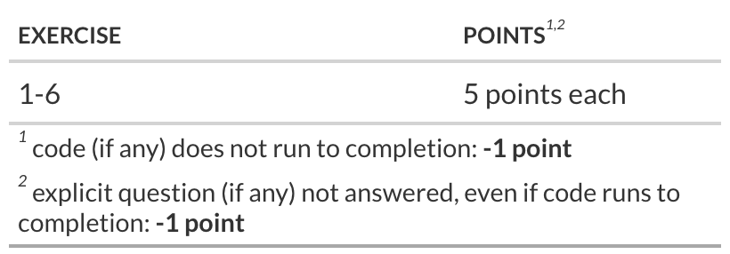

## Introduction

In today's lab, you'll practice sampling from distributions and working with Markov chains.

## Getting started

-   To complete the lab, log on to **your** github account and then go to the class [GitHub organization](https://github.com/bsmm-8740-fall-2025) and find the **2025-lab-9-\[your github username\]** repository .

    Create an R project using your **2025-lab-9-\[your github username\]** repository (remember to create a PAT, etc.) and add your answers by editing the `2025-lab-9.qmd` file in your repository.

-   When you are done, be sure to: **save** your document, **stage**, **commit** and [**push**]{.underline} your work.

::: callout-important
To access Github from the lab, you will need to make sure you are logged in as follows:

-   username: **.\\daladmin**
-   password: **Business507!**

Remember to (create a PAT and set your git credentials)

-   create your PAT using `usethis::create_github_token()` ,
-   store your PAT with `gitcreds::gitcreds_set()` ,
-   set your username and email with
    -   `usethis::use_git_config( user.name = ___, user.email = ___)`
:::

## Packages

```{r}
#| echo: false
#| message: false
#| warning: false
# check if 'librarian' is installed and if not, install it
if (! "librarian" %in% rownames(installed.packages()) ){
  install.packages("librarian")
}
  
# load packages if not already loaded
librarian::shelf(expm, ggplot2, magrittr, tidyverse)
theme_set(theme_bw(base_size = 18) + theme(legend.position = "top"))
```

## Exercise 1: Markov Chains

Here is a four-state Markov chain that could model customer loyalty for a subscription-based service, with one month between steps in the chain.

[**States**]{.underline}:

-   State A (New Customer): The customer has just signed up.
-   State B (Engaged Customer): The customer is actively using the service and seems satisfied.
-   State C (At-Risk Customer): The customer is showing signs of disengagement (e.g., reduced usage or negative feedback).
-   State D (Churned Customer): The customer has canceled their subscription.

[**Transition Probabilities**]{.underline}:

-   From State A (New Customer), there’s a high chance the customer either becomes engaged (State B) or starts showing signs of disengagement (State C).
-   From State B (Engaged Customer), there’s a probability of remaining engaged or transitioning to at-risk (State C), and a smaller probability of churning (State D).
-   From State C (At-Risk Customer), the customer may either re-engage (return to State B) or churn (State D).
-   From State D (Churned Customer), it's possible the company might re-acquire the customer through marketing efforts, which would move them back to State A.

This type of Markov model can help businesses predict customer behavior, optimize marketing efforts, and focus on retention strategies.

What is the probability that a customer that has [just signed up]{.underline} is [still a customer after 6 months]{.underline}?

::: {#Q1 .callout-note appearance="simple" icon="false"}
## YOUR ANSWER Q1:

```{r}
#| echo: true
#| eval: false
# the transition matrix is
P <- 
  matrix(
    c(0, 0.6, 0.4, 0,
      0, 0.75, 0.25, 0,
      0, 0.5, 0, 0.5,
      0.3, 0, 0, 0.7
      )
    , nrow =4, byrow = TRUE
  )

# use %^% from the expm package to compute the k-th power of a matrix (k = 6 months)
initial_state <- c(1, 0, 0, 0) # Starting with Initial state A which is at index 1

# Calculating probability after 6 months
state_after_6_months <- initial_state
for (i in 1:6) {
  state_after_6_months <- state_after_6_months %*% P
}

# sum the probabilities of the non-churned customer states after 6 steps
probability_still_customer <- sum(state_after_6_months[1:3])

cat("Probability that customer is still a customer after 6 months is", round(probability_still_customer * 100, 2), "%\n")

```

The probability that a customer that has just signed up is still a customer after 6 months is \_[**74.85\_**]{.underline}\_%
:::

## Exercise 2: Markov Chains

A simpler customer churn model for each monthly period is as follows:

-   a current subscriber cancels their subscription with probability 0.2
-   a current non-subscriber starts their subscription with probability with probability 0.06

write the state transition matrix $\mathsf{P}_{i,j}$, and compute the [**stationary distribution**]{.underline} $\pi$ for this Markov Chain, confirming that $\pi\mathsf{P}=\pi$ and that the sum of the elements of $\pi$ equals $1.0$.

What percent of customers remain once the chain has reached the steady state?

::: {#Q2 .callout-note appearance="simple" icon="false"}
## YOUR ANSWER Q2:

```{r}
#| echo: true
#| eval: false
# replace the placeholders '_' with the state transition probabilities
P <- 
  matrix(
    c(0.8, 0.06,
      0.2, 0.94
      ), nrow =2, byrow = TRUE)

# Computing transpose (I-P) and adding row of 1s to bottom 
# Calling resulting matrix as A
A <- matrix(c(0.2,-0.06,-0.2,0.06),
            nrow = 2, byrow = TRUE)
A <- rbind(A, c(1,1))

# Vector b with elements [0,1] to solve A * pi = b
b <- c(0,0,1)

pi <- qr.solve(A,b)
pi <- as.numeric(pi)

# Printing the stationary distribution
cat("Stationary distribution pi: ", pi , "\n")

# Checking if pi * P = pi
calc <- pi %*% P
cat("pi * P: ", calc, "\n pi:", pi)

# Checking if sum of pi is 1
cat("Sum of pi: ", sum(pi) == 1)

# Percentage of customers that will remain subscribers in steady state
cat("The percentage of customers remaining as subscribers in steady state is", round(pi[1] * 100, 2), "%\n")
```

```{r}
#| echo: true
#| label: calculate the stationary distribution between subscriber and non-subscriber for this model
# compute transpose(I-P) and add a row of 1's to the bottom 
# call the resulting matrix A
A <- 

# create a vector called b with the # of elements equal to the number of rows of A
# with elements all zero but the last one
b <- 
  
# compute pi by solving (A x pi) = b using qr.solve
pi <- 

# confirm (pi x P) = pi and 
# show your work  
  
# confirm pi[1] + pi[2] == 1
# show your work
  

```

In the steady state, the probability of being a current customer is \_[**\_23.08**]{.underline}\_%
:::

## Exercise 3: Acceptance probability

We want to sample from the Poisson distribution $\mathbb{P}(X=x)\sim \lambda^xe^{-\lambda}/x!$ using a Metropolis Hastings algorithm.

For the proposal we toss a fair coin and add or subtract 1 from $x$ to obtain $y$ as follows:

$$
q(y|x)=\begin{cases}
\frac{1}{2} & x\ge1,\,y=x\pm1\\
1 & x=0,\,y=1\\
0 & \mathrm{otherwise}
\end{cases}
$$ show that the acceptance probability is

$$
\alpha(y|x)=\begin{cases}
\min\left(1,\frac{\lambda}{x+1}\right) & x\ge1,\,y=x+1\\
\min\left(1,\frac{x}{\lambda}\right) & x\ge2,\,y=x-1
\end{cases}
$$

and $\alpha(1|0)=\min(1,\lambda/2)$, $\alpha(0|1)=\min(1,2/\lambda)$. NOTE: there are 4 cases to consider.

::: {#Q3 .callout-note appearance="simple" icon="false"}
## YOUR ANSWER Q3:

```{r}
## Metropolis–Hastings sampler for Poisson(lambda)

mh_pois <- function(n_iter, lambda, x0 = 0) {
  x <- integer(n_iter)
  x[1] <- x0
  
  # function for acceptance probability α(y|x)
  acc_prob <- function(x, y, lambda) {
    # target π(x) ∝ λ^x / x!
    pi_x <- lambda^x / factorial(x)
    pi_y <- lambda^y / factorial(y)
    
    # proposal probabilities q(y|x) and q(x|y)
    q_y_given_x <- if (x >= 1 && y %in% c(x-1, x+1)) {
      0.5
    } else if (x == 0 && y == 1) {
      1
    } else {
      0
    }
    
    q_x_given_y <- if (y >= 1 && x %in% c(y-1, y+1)) {
      0.5
    } else if (y == 0 && x == 1) {
      1
    } else {
      0
    }
    
    # MH ratio
    r <- (pi_y * q_x_given_y) / (pi_x * q_y_given_x)
    alpha <- min(1, r)
    return(alpha)
  }
  
  for (t in 2:n_iter) {
    current <- x[t-1]
    
    # propose y
    if (current == 0) {
      y <- 1
    } else {
      if (runif(1) < 0.5) {
        y <- current + 1
      } else {
        y <- current - 1
      }
    }
    
    # accept / reject
    a <- acc_prob(current, y, lambda)
    if (runif(1) < a) {
      x[t] <- y
    } else {
      x[t] <- current
    }
  }
  
  return(x)
}

## Example run
set.seed(123)
lambda <- 4
chain <- mh_pois(n_iter = 10000, lambda = lambda, x0 = 0)

## Compare with true Poisson(λ)
par(mfrow = c(1, 2))
hist(chain, breaks = 0:20 - 0.5, main = "MH samples", xlab = "x", freq = FALSE)
xs <- 0:20
points(xs, dpois(xs, lambda), pch = 19, cex = 0.8)
plot(table(chain) / length(chain), main = "Empirical vs true", xlab = "x", ylab = "probability")
points(xs, dpois(xs, lambda), pch = 19, cex = 0.8)

```
:::

## Exercise 4: Samples from Poisson pmf

Given the following function for the acceptance probability

```{r}
#| label: define the acceptance probability function (see exerise 3) 
alpha <- function(y,x, lambda){
  if(x >= 1 & y == x+1){
    min(1,lambda/(x+1))
  }else if(x >= 2 & y == x-1){
    min(1,x/lambda)
  }else if(x == 0 & y == 1){
   min(1,lambda/2)
  }else{
    min(1,2/lambda)
  }
}
```

1.  Write a MH algorithm to draw 2000 samples from a from a Poisson pmf with $\lambda = 20$ starting from $x_0=1$.

2.  Compare the sample quantiles at probabilities **c(0.1,.25,0.5, 0.75, 0.9)** with the theoretical quantiles for the Poisson distribution (using the `qpois` function)

::: {#Q4 .callout-note appearance="simple" icon="false"}
## YOUR ANSWER Q4:

```{r}
#| echo: true
#| eval: false
# MH algorithm drawing samples from a Poisson(20) pmf
metropolis_hastings_poisson <- function(lambda, n_samples, x0){
  samples <- numeric(n_samples)
  samples[1] <- x0
  for(i in 2:n_samples){
    x <- samples[i-1]
    y <- ifelse(runif(1) > 0.5, x+1, x-1)
    acc_prob <- alpha(y,x,lambda)
    
    if(runif(1) < acc_prob){
      samples[i] <- y
    }else{
      samples[i] <- x
    }
  }
  return(samples)
}

set.seed(42)
lambda <- 20
n_samples <- 2000
x0 <- 1 # Initial state
samples <- metropolis_hastings_poisson(lambda, n_samples,x0)

sample_quantiles <- quantile(samples, probs = c(0.1,0.25,0.5,0.75,0.9))
theoretical_quantiles <- qpois(c(0.1,0.25,0.5,0.75,0.9), lambda = lambda)

result <- data.frame(
  Probability = c(0.1,0.25,0.5,0.75,0.9),
  Sample_Quantiles = sample_quantiles,
  Theoretical_Quantiles = theoretical_quantiles
  )

result
```
:::

## Exercise 5: A Loan Portfolio

Our client is a bank with both asset and liability products in retail bank industry. Most of the bank's assets are loans, and these loans generate the majority of the total revenue earned by the bank. Hence, it is essential for the bank to understand the proportion of loans that have a high likelihood to be paid in full and those which will finally become Bad loans.

All the loans that have been issued by the bank are classified into one of four categories/states :

1.  **Good Loans** : These are the loans which are in progress but are given to low risk customers. We expect most of these loans will be paid up in full with time.
2.  **Risky loans** : These are also the loans which are in progress but are given to medium or high risk customers. We expect a good number of these customers will default.
3.  **Bad loans** : The customer to whom these loans were given have already defaulted.
4.  **Paid up loans** : These loans have already been paid in full.

Your research has suggested the following state transition matrix for the bank loans

```{r}
#| echo: true
#| eval: false
# the 1-year state transition matrix for loans is:
P <- 
  matrix(
    c(0.7, 0.05, 0.03, 0.22,
      0.05, 0.55, 0.35, 0.05,
      0, 0, 1, 0, 
      0, 0, 0, 1
      )
    , nrow =4, byrow = TRUE
  )
```

Answer the following questions, given that the bank's records indicate 60% of the loans on the books are 'good loans' and 40% are 'risky loans'. (*use this as the initial state*)

::: {#Q5 .callout-note appearance="simple" icon="false"}
## YOUR ANSWER Q5:

```{r}
#| label: use the transition matrix to predict the composition of the loan portfollio
# Q5: Predict the composition of the loan portfolio after 1 and 2 years

# 1. Transition matrix P (Good, Risky, Bad, Paid)
P <- matrix(
  c(0.7,  0.05, 0.03, 0.22,
    0.05, 0.55, 0.35, 0.05,
    0,    0,    1,    0,
    0,    0,    0,    1),
  nrow = 4, byrow = TRUE
)
colnames(P) <- rownames(P) <- c("Good","Risky","Bad","Paid")

# 2. Initial portfolio: 60% Good, 40% Risky, 0% Bad, 0% Paid
v0 <- c(Good = 0.60, Risky = 0.40, Bad = 0.00, Paid = 0.00)

# 3. Portfolio after 1 year
v1 <- v0 %*% P

# 4. Portfolio after 2 years
v2 <- v1 %*% P   # or v0 %*% (P %*% P)

# 5. Print results (in percentages, rounded)
round(v1 * 100, 1)  # composition at end of 1 year
round(v2 * 100, 1)  # composition at end of 2 years


```

```{r}
#| label: predict the pct of loans that start as good and are paid in 20 yrs
# What percentage of good loans are paid in full after 20 years
# Q: What percentage of GOOD loans are PAID in full after 20 years?

# Transition matrix P
P <- matrix(
  c(0.7,  0.05, 0.03, 0.22,
    0.05, 0.55, 0.35, 0.05,
    0,    0,    1,    0,
    0,    0,    0,    1),
  nrow = 4, byrow = TRUE
)
colnames(P) <- rownames(P) <- c("Good","Risky","Bad","Paid")

# Initial state: 100% Good loans
v0 <- c(1, 0, 0, 0)

# 20-year transition matrix
P20 <- P %*% (P %^% 19)   # alternative: use matrixPower from 'expm' package

# Composition after 20 years
v20 <- v0 %*% P20

# Percentage of GOOD loans that are PAID in 20 years
round(v20[4] * 100, 4)

```

\_[**\_76.5112\_**]{.underline}❓ percent of good loans are paid in full after 20 years

```{r}
#| label: predict the pct of loans that start as risky and are paid in 20 yrs
# What percentage of risky loans are paid in full after 20 years
# Q: What percentage of RISKY loans are paid in full after 20 years?

library(expm)    # for matrix power

# Transition matrix
P <- matrix(
  c(0.7,  0.05, 0.03, 0.22,
    0.05, 0.55, 0.35, 0.05,
    0,    0,    1,    0,
    0,    0,    0,    1),
  nrow = 4, byrow = TRUE
)
colnames(P) <- rownames(P) <- c("Good","Risky","Bad","Paid")

# Initial state: 100% risky loans
v0 <- c(0, 1, 0, 0)

# 20-year transition matrix
P20 <- P %^% 20

# Composition after 20 years
v20 <- v0 %*% P20

# Percentage that end in PAID state
round(v20[4] * 100, 4)

```

[**\_19.5946\_**]{.underline}\_❓ percent of risky loans are paid in full after 20 years
:::

## Exercise 6: A New Covariance Calculation

Given $\bar{a}\equiv\frac{1}{T}\sum_{t=1}^T a_t$ (the mean) and sequences $\left\{a_t\right\}_{t=1}^T$ and $\left\{b_t\right\}_{t=1}^T$, we have the following calculation for the population covariance:

$$
\frac{1}{T}\sum_{t=1}^T(a_t-\bar{a})(b_t-\bar{b})
$$

Statisticians have long interpreted this as a measure of how much the measurements $a_t$ and $b_t$ co-vary. If $a_t=b_t$ then this formula calculates the population variance of $a_t$, a measure of the dispersion or spread of the values of $a_t$.

Some data scientists have suggested that this formula does not measure variation at all, since self-evidently there are no differences in the formula, other than mean differences, that would capture the variation.

Instead, data scientists have suggested that the following calculation, which sums all possible differences, should be use to estimate co-variation. With $\Delta_k a_t \equiv a_{t+k}-a_t$ (the $k^{th}$ difference) the co-variation is calculated as:

$$\frac{1}{T^2}\sum_{k=1}^{T-1}\sum_{t=1}^{T-k} \Delta_k a_t \Delta_k b_t$$

Use samples of 10, 20, 50, 100, 200, 500, 1000, 2000, 5000 from $a\sim\mathcal{N}(1,1)$ and $b\sim a+\mathcal{N}(4,2)$, and calculate the covariance both ways, putting the result into a table.

Confirm that the calculation below computes the covariance both ways. How do the calculations compare?

::: {#Q6 .callout-note appearance="simple" icon="false"}
## YOUR ANSWER Q6:

```{r}
# NOTE: (dplyr::lead(a,k) - a) is key to this calculation
set.seed(8740)

count <- c(10,20,50)
tibble::tibble(
  T = c(count, count*10, count*100)
) |> 
  dplyr::mutate(
    result =                                        # result is a nested columns
      purrr::map(
        T # a vector of sample counts: 10, 20, .., 2000, 5000
        , (\(t){                                    # a function for each count t
          a <- rnorm(n = t, mean = 1, sd = 1)       # t samples from N(1,1) -> a
          b <- a + rnorm(n = t, mean = 4, sd = 2)   # t samples from a + N(4,2) -> b
          tibble::tibble(                           # store the calculations in a tibble
            cov = mean((a - mean(a))*(b - mean(b))) # calculate covariance the usual way
            , alt_cov =                             # now calculate covariance the new way
              1:(t-1) |>                            # on differences 1 to (t-1)
              purrr::map_vec(
                (\(k){                              # a function for each difference k
                  (                                 # calculate the terms in the inner sum
                    (dplyr::lead(a,k) - a) * (dplyr::lead(b,k) - b)) |> 
                    sum(na.rm=TRUE) 
                })
              ) |> sum(na.rm=TRUE) / (t*t)          # the outer sum divided by count^2
          )                                         # end: a tibble with two entries
        })
      )
  ) |> tidyr::unnest(result)                        # unnest the calculations


```

How do the two covariance calculations compare: [**They are the same – for every sample size the alternative formula gives virtually identical values to the standard covariance (differences only due to tiny rounding error).**]{.underline}
:::

::: render-commit-push
You're done and ready to submit your work! **Save**, **stage**, **commit**, and **push** all remaining changes. You can use the commit message "Done with Lab 6!" , and make sure you have committed and pushed all changed files to GitHub (your Git pane in RStudio should be empty) and that **all** documents are updated in your repo on GitHub.
:::

## Grading

Total points available: 30 points.

{fig-align="center" width="600"}
