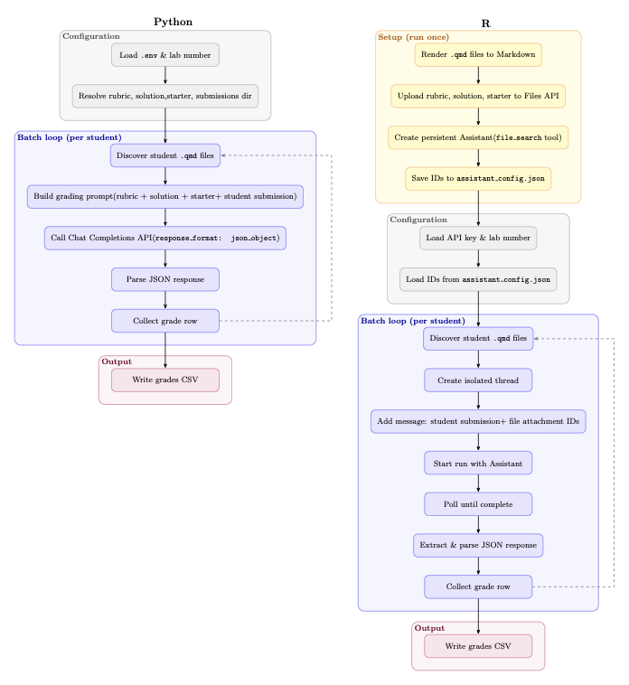

# Introduction

This paper describes LLM-based software for auto-grading student assignments. The software is suited both for self-learning and adoption by instructors that use long-form text-based assignments to assess both coding skills and understanding of concepts. The target audience for this paper is instructors in higher education, faced with large class sizes and assessment resources that do not scale to the class size.

The materials are licensed under the GPL-3 and have been made publicly available at: <https://github.com/lodette/JOSE_paper> and [here](https://doi.org/10.5281/zenodo.19410580).

# Statement of Need

The code described in this paper was developed in response to constrained grading resources. The authors teach a course with an enrollment of 45-50 students and are required to grade 10 questions per assignment for 9 assignments. The time budget was three hours per assignment, as imposed by external contracts.

Our assignments are a mix of multi-part programming questions in R, open-ended statistics questions that require both conceptual understanding and practical application, and closed-ended and numerical questions, so manual grading would not scale to the class size, given the time constraint.

This is a not uncommon situation [@akyash2025; @qui2025; @on2025], and approaches to the assessment scaling problem have evolved from rule-based and pattern-matching systems for multiple choice questions and simple short-answer questions [@Hussein2019Automated; @Mizumoto2023Exploring; @Ramesh2021An; @Tack2024Automated] through deep-learning and automated code evaluation systems [@Misgna2024A; @Taghipour2016A; @Uto2023Integration], to current sophisticated models leveraging deep learning and large language models (LLMs) [@Beseiso2021A; @ElMassry2025A; @Ren2025Intelligent; @Song2024Automated; @Wang2024EffectivenessOL]. The challenge of assessment is particularly acute for massive open on-line courses (MOOCs) [@on2025].

There are automated grading systems, both commercial [@akindi2024; @Halgamuge2017] and open source [@Hamrick2016], though grading systems per se often require adherence to a predefined question and answer framework and corresponding assignment engineering to match the framework. In our course we needed fewer constraints on the form of questions and developed a flexible LLM solution to grade assignments.

While the use of LLMs for grading promise greater flexibility, both for the instructors in writing assignments and the instructors and TAs in grading the assignments, the availability of LLM-based graders lags that of more rigid frameworks. At most basic prompts have been published [@jukiewicz2025; @qui2025; @the2025; @zhao2025]. Thus we wrote our own [@sarim2026].

We created a system to grade markdown-based assignments. In our course we created an organization on GitHub to host assignments, and each student had a private repository under the Organization for each assignment. Each student repository contained an assignment in a markdown file long with relevant artifacts (image, data and pdfs). The student followed the instructions in the markdown file and wrote their answers to each question in the assignment document. At the assignment deadline the student committed and pushed their assignment and post-deadline, repositories were cloned and then assessed by our LLM-based grader. The LLM grader returns a grade and student feedback for each question in the assignment.

# Story of the project

This project began as a practical response to an immediate teaching constraint: a growing enrollment, a fixed time budget for grading, and assignments that could not be reduced to simple multiple-choice formats. We iterated from informal prompting to a repeatable workflow that preserves instructor intent, produces per-question feedback, and fits within the operational realities of a 13 week long course.

The software was used in a graduate business course on Data Analytics with a class size of 50, weekly student assignments and a union-imposed grading time-budget of 3 hours per week. Allowing for time to prepare grading rubrics for each assignment, process the student work using the LLM grader described here and review the results, put us within our budget constraint.

# Functionality and Usage

## Summary of high-level functionality

The codebase provides functionality for grading of student assignments. It deals with varying numbers of assignment questions and can evaluate a mix of programming questions, open-ended statistics questions that require both conceptual understanding and practical application, and closed-ended and numerical questions. In the code, OpenAI's ChatGPT [@chatgpt2025] is used by default and requires a user API key. With the corresponding API keys, Claude and Gemini could be used [@claude2025; @gemini2025]. Both R-centric and Python-centric versions are provided.

Assignments are written in variants of Markdown. The LLM grader is given a folder with all student assignments, where each student's assignment in a separate subfolder, along with an assignment without answers, an assignment with solutions, and a grading rubric in a JSON file. The grader script then processes student submissions in batch.

The output is a csv file containing, for each student and assignment, the grade for each question in the assignment and text feedback for each question.

## Requirements

### Environment variables

Both R and Python versions use an environment variable `OPENAI_API_KEY` to store API credentials. The Python version additionally uses the environment variable `BASE_LAB_DIR` to specify the directory containing the assignment materials and student submissions.

### Usage

The Python version of the grader assumes a folder in the assignments directory is named lab-N, containing the assignments for assignment $N$, and the program is invoked with one of the following commands executed in the terminal:

``` python
python batch_grade.py              # uses default (lab 9)
python batch_grade.py --lab-number 4 # grade lab 4 
python batch_grade.py -n 4 # short form
```

The R version of the grader similarly assumes a folder in the assignments directory is named lab-N, containing the assignments for assignment $N$, and the R program is invoked with the following comands executed in the R Console:

``` r
# Override lab number before calling main()
LAB_NUMBER <- 4
source("R/chat_grading_runner.R")
main()
```

### Rubrics

The grader assumes a JSON file containing the rubric for the current assignment. The rubric is defined by the schema in the file rubric_schema.json, and a draft assignment rubric can be generated using a graded copy of the assignment and the R function R/json_build.R.

## Control Flow

The R and Python versions operate slightly differently. The R grading pipeline automates the evaluation of student lab submissions using the OpenAI Assistants API v2 while the Python version uses the OpenAI Chat Completions API. The R version uses a separate setup phase to render the markdown files to temporary files and upload them, along with the JSON rubric, to the OpenAI Files API. An Assistant is created which can retrieve relevant content from the uploaded files at inference time.

The high-level control flow of both versions are shown in Figure 1 below.

{fig-align="center"}

## Evaluation

For quality control, in each assignment, a sample of LLM grades are reviewed by the instructor or TA for completeness and veracity. This review also allows for catching occasional issues with the availablity of OpenAI servers.

To evaluate the consistency of the LLM graders, understanding that LLMs are not deterministic, we used both LLM versions to grade multiple assignments and student submissions, repeating each 50 times, and compared the results. The standard deviation of each grade was within 0.25 of a grade point, and the R an Python versions agreed to within one standard deviation.

# References {#references .unnumbered}
